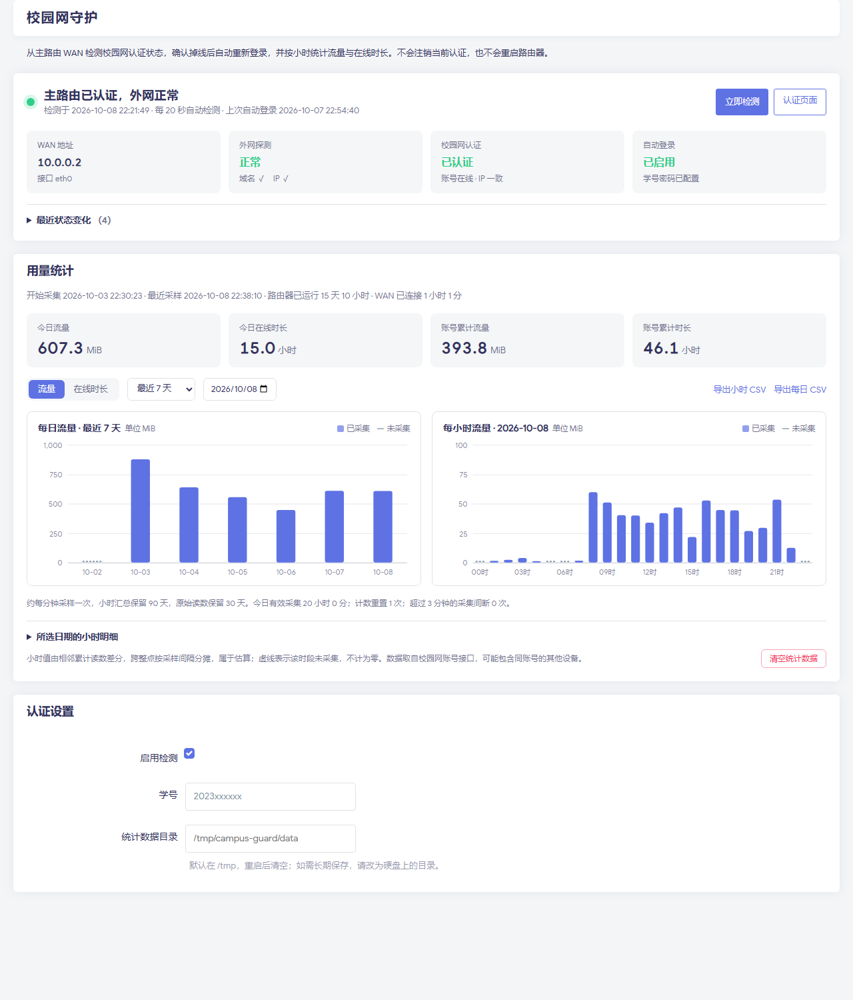

# NWU 校园网守护

运行在 OpenWrt / iStoreOS 主路由上的西北大学（NWU）校园网守护程序：从 WAN 口持续检测网络，确认校园网认证掉线后自动重新登录，并按天、按小时统计流量和在线时长。自带 LuCI 管理页面。



<sub>截图使用示例数据。</sub>

## 功能

- **掉线自动重登**：每 20 秒检测一次。只有连续两轮都出现可信的 `calogin.nwu.edu.cn` 认证跳转，跳转里的 IP 与当前 WAN 地址一致，且认证接口确认离线时，才会登录。
- **不误操作**：认证仍有效、WAN 断开或只是普通外网故障时都不会重复登录。登录失败后按指数退避冷却，最长 30 分钟。遇到验证码、账号前缀或认证协议变化时停止自动登录，并在页面提示原因。
- **用量统计**：直接使用检测时已经请求的认证状态接口，不额外发请求。约每分钟采样一次，提供每日（7/30/90 天）和每小时图表、小时明细，以及 UTF-8 CSV 导出。
- **手动清理**：页面上可以一键清空「最近状态变化」记录和用量统计数据。按钮需要点两次确认，并和检测进程共用同一把锁，避免清空的同时被写回旧数据。
- **账号安全**：学号密码只保存在路由器的 `/etc/config/campus_guard` 中，文件权限 600。密码写入权限 600 的临时 curl 配置文件，不会出现在进程命令行或日志里。状态接口需要先登录 LuCI，且不返回学号密码。

## 目录结构

```
root/                    安装到路由器根目录的文件
  etc/config/campus_guard    UCI 配置（首次安装时写入）
  etc/init.d/campus-guard    procd 服务
  usr/share/campus-guard/    检测主程序、统计、断网恢复测试脚本
luasrc/                  LuCI 页面（安装到 /usr/lib/lua/luci/）
  controller/                菜单与 JSON 接口
  model/cbi/                 设置表单
  view/campus_guard/         状态与用量仪表盘
tests/                   在路由器上运行的单元测试
openclash/               旁路由 OpenClash 的校园域名直连/DNS 修复脚本
scripts/deploy.py        通过 SSH 一键安装
tools/                   开发时用的辅助脚本
docs/                    设计记录与断网恢复实测
```

## 安装

需要路由器上已有 `lua`、`luci-base`、`luci-compat` 和 `curl`（iStoreOS 默认自带）。另外，本机要能通过 SSH 密钥登录路由器。

```sh
python scripts/deploy.py root@192.168.1.1
```

装好后打开 **LuCI → 服务 → 校园网守护**，填写学号、密码和登录选项（纯学号 / 电信 / 联通），保存并应用即可。

### 统计数据目录

统计数据默认存放在 `/tmp/campus-guard/data`，路由器重启后会清空。如需长期保存，请在页面的「统计数据目录」中改成硬盘上的路径，例如 `/mnt/sda1/campus-guard`。不建议直接写到系统闪存。程序只会在这个目录的上级目录已存在时写入，因此硬盘没有挂载时不会误写到闪存。

## 测试

在路由器上运行：

```sh
lua tests/test-metrics.lua   # 统计：跨午夜分摊、计数重置、长间断、保留期等
lua tests/test-guard.lua     # 守护逻辑：10 个隔离场景（在线不重登、冷却、验证码等）
```

断网恢复的实测方法见 [docs/recovery-test.md](docs/recovery-test.md)。测试会真实注销一次认证，然后观察守护程序能否自动恢复。

## 旁路由（可选）

如果局域网设备经过 OpenClash 等 Fake-IP 旁路由上网，`calogin.nwu.edu.cn` 可能被解析成 `198.18.x.x`，导致认证页面无法访问。`openclash/` 下的脚本会把 `nwu.edu.cn` 加入 Fake-IP 过滤和直连规则，并交给主路由解析。主路由地址可以用环境变量 `CAMPUS_DNS` 指定。

## 说明

- 认证服务器地址固定为实测得到的 `172.30.9.18`（UCI 选项 `portal_ip`）。如果学校更换了认证服务器，请修改这个选项。
- 本项目只用于给自己的账号做自动重连，请遵守学校的网络使用规定。

## License

[MIT](LICENSE)
